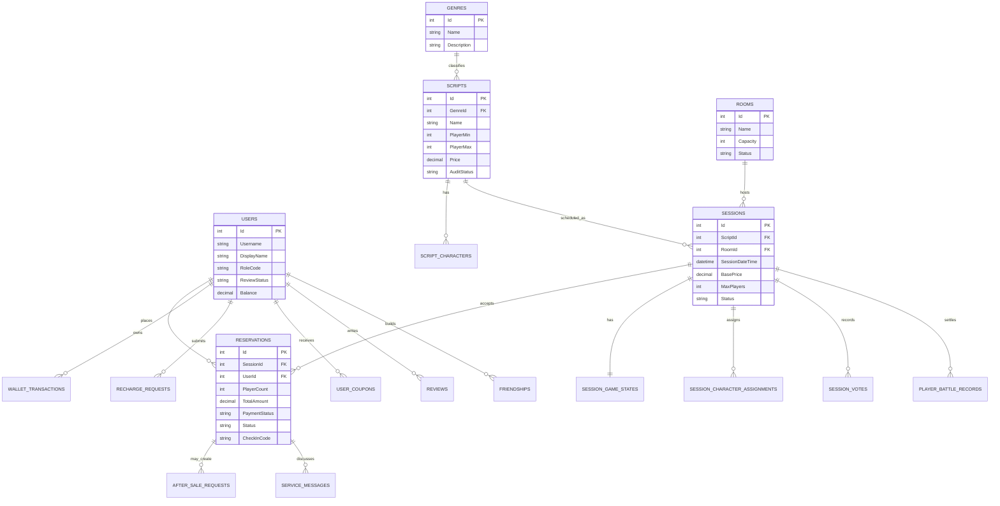
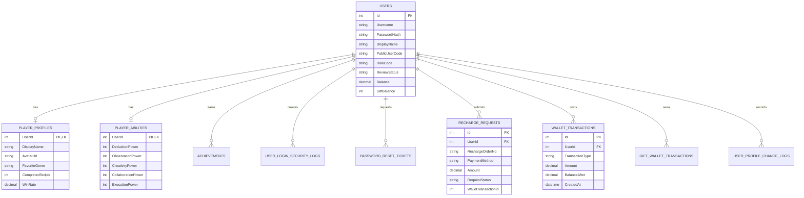
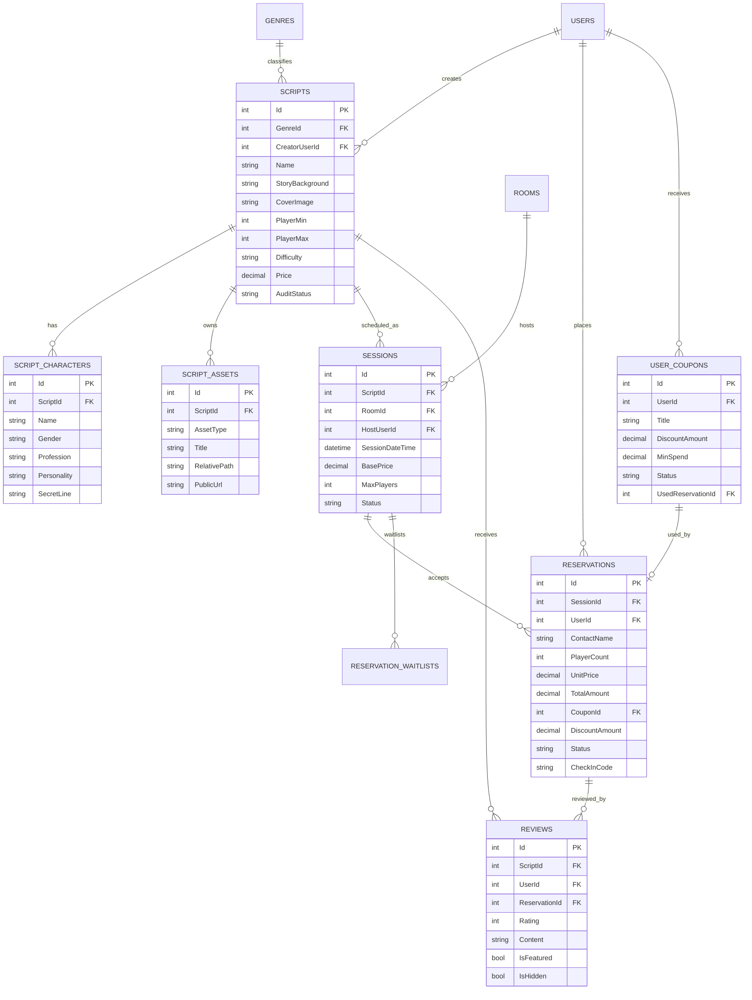
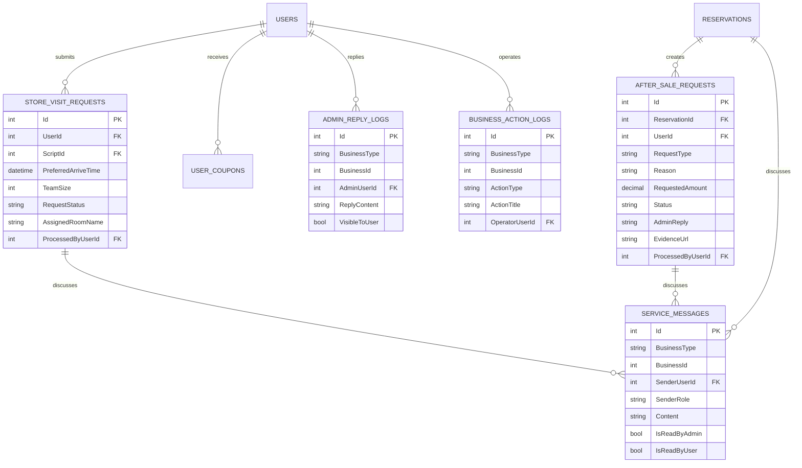
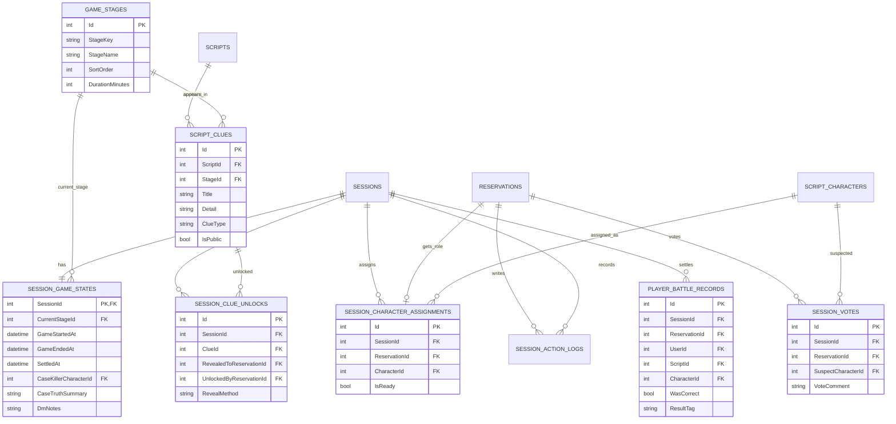
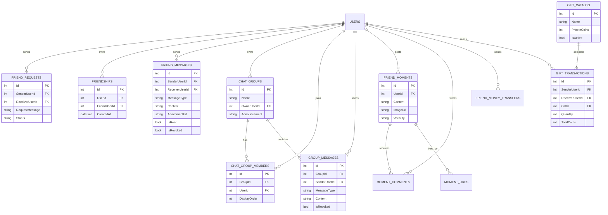

# ER 图配套讲解文档

本文档用于配合讲解 `DramaMurderGraduation` 剧本杀门店运营与玩家服务系统的数据库设计。项目表数量较多，如果全部放在一张 ER 图中会影响答辩展示效果，因此这里按业务主线拆成多张图：

- 核心业务总览图
- 用户、钱包与权限图
- 剧本、场次、预约与评价图
- 后台审核、售后与服务沟通图
- 游戏房间与 DM 场控图
- 好友社交与互动图

图中的实体名采用大写下划线形式，便于 Mermaid 图阅读；它们与数据库真实表名一一对应。例如 `USERS` 对应 `Users`，`SESSION_GAME_STATES` 对应 `SessionGameStates`。讲解时可先说明“英文实体名是数据库落地结构，中文解释是业务含义”。

## 1. 讲解切入点

本系统围绕剧本杀门店的完整业务链路设计数据库：

1. 用户注册、审核、登录，形成可管理的会员体系。
2. 门店维护剧本、房间和场次，玩家选择场次并在线预约。
3. 预约成功后扣减钱包余额，生成订单、核销码和后续服务记录。
4. 后台管理员处理用户审核、充值审核、预约确认、售后、评价和内容审核。
5. DM 根据场次进入游戏房间，完成角色分配、阶段推进、线索发放、投票和结算。
6. 玩家在好友、群聊、动态、礼物和转账模块中形成社交闭环。

数据库设计的主线可以概括为：

```text
用户 Users
  -> 剧本 Scripts / 房间 Rooms / 场次 Sessions
  -> 预约 Reservations
  -> 钱包 WalletTransactions / 优惠券 UserCoupons / 售后 AfterSaleRequests
  -> 游戏状态 SessionGameStates / 角色分配 SessionCharacterAssignments / 投票 SessionVotes
  -> 战绩 PlayerBattleRecords / 评价 Reviews / 社交 Friendships
```

## 2. 核心业务总览 ER 图

这张图适合放在讲解开头，用于说明系统不是单一预约系统，而是“门店运营 + 玩家服务 + 游戏过程”的综合业务系统。



讲解重点：

- `Users` 是系统身份中心，几乎所有业务最终都关联到用户。
- `Scripts` 是内容中心，通过 `Genres` 分类，并通过 `Sessions` 变成可预约的门店场次。
- `Reservations` 是订单中心，连接用户、场次、支付、售后、评价和游戏房间。
- `SessionGameStates`、`SessionCharacterAssignments`、`SessionVotes` 说明系统不止做到预约，还覆盖了剧本杀开局后的过程管理。

## 3. 用户、权限与钱包 ER 图

这张图用于讲解账号审核、角色权限和资金流。



讲解重点：

- `Users.RoleCode` 控制角色能力，典型值包括 `Admin`、`Player`、`DM`、`Finance`、`Ops`、`Service`、`Content`。
- `Users.ReviewStatus` 控制账号是否能进入受保护页面，注册后默认为待审核，审核通过后才能正常使用。
- `PlayerProfiles` 和 `PlayerAbilities` 是玩家展示层数据，用于玩家中心、好友主页和能力雷达。
- `RechargeRequests` 记录充值申请；`WalletTransactions` 记录真实余额流水。这样做的好处是“申请”和“到账流水”分离，方便后台审核和财务追踪。
- `UserLoginSecurityLogs`、`PasswordResetTickets`、`UserProfileChangeLogs` 支持安全中心和资料变更审计。

## 4. 剧本、房间、场次、预约与评价 ER 图

这张图是项目最核心的业务主线，建议作为答辩重点。



讲解重点：

- `Genres -> Scripts` 表示剧本分类。
- `Scripts -> ScriptCharacters` 表示一个剧本包含多个角色。
- `Scripts -> ScriptAssets` 表示剧本可以挂载素材，例如主持手册、图片、文档、线索资料等。
- `Scripts + Rooms -> Sessions` 表示“剧本”和“房间”组合成一个具体可预约场次。
- `Sessions -> Reservations` 表示一个场次可以被多个玩家预约。
- `Reservations` 中保存人数、单价、总价、支付状态、订单状态和核销码，是订单业务核心。
- `UserCoupons` 通过 `UsedReservationId` 和 `Reservations.CouponId` 与预约订单关联，实现下单抵扣。
- `Reviews` 可以绑定到剧本和具体预约，保证评价来源可追踪。

预约下单时的核心数据动作：

1. 查询 `Sessions` 剩余容量。
2. 校验 `UserCoupons` 是否可用。
3. 扣减 `Users.Balance`。
4. 写入 `WalletTransactions`。
5. 写入 `Reservations`。
6. 标记优惠券已使用。

## 5. 后台审核、售后与服务沟通 ER 图

这张图用于说明后台不是简单的管理列表，而是围绕业务单据做状态流转和沟通记录。



讲解重点：

- 后台业务按照 `BusinessType + BusinessId` 组织，能兼容预约、到店联系、售后等不同业务单据。
- `ServiceMessages` 是用户和后台之间的沟通记录，通过 `BusinessType` 区分是哪类业务。
- `AdminReplyLogs` 记录管理员对用户可见的正式回复。
- `BusinessActionLogs` 记录后台操作轨迹，用于审计和运营追踪。
- `AfterSaleRequests` 与 `Reservations` 关联，一个预约订单可以发起售后、退款、改期或申诉。
- `StoreVisitRequests` 表示未直接下单前的到店咨询需求，适合团队询价、门店安排和线下接待。

## 6. 游戏房间与 DM 场控 ER 图

这张图是项目的亮点。它说明系统从“预约订单”继续延伸到“实际游戏过程”。



讲解重点：

- `GameStages` 是全局阶段字典，例如开场导入、线索搜证、集中推理、终局复盘。
- `SessionGameStates` 是每一场游戏的运行状态，记录当前阶段、开局时间、结算时间、真凶角色、真相摘要和 DM 私有备注。
- `SessionCharacterAssignments` 把预约订单和剧本角色绑定起来，表示某个玩家在这一场中拿到哪个角色。
- `ScriptClues` 是剧本线索库；`SessionClueUnlocks` 是某一场游戏实际解锁了哪些线索。
- `SessionActionLogs` 记录玩家搜证、DM 广播、阶段推进、线索发放等过程。
- `SessionVotes` 记录终局投票，同一预约在同一场次只有一条当前投票。
- `PlayerBattleRecords` 是结算结果表，游戏结束后把玩家是否投对、角色、剧本、房间等信息固化为战绩。

游戏过程讲解顺序：

1. 玩家预约成功，形成 `Reservations`。
2. 进入游戏房间时，根据 `Reservations.SessionId` 初始化 `SessionGameStates`。
3. 系统为每个有效预约分配 `ScriptCharacters`，写入 `SessionCharacterAssignments`。
4. DM 开局后更新 `GameStartedAt`。
5. 玩家提交搜证行动，写入 `SessionActionLogs`，并可能解锁 `SessionClueUnlocks`。
6. DM 推进阶段，更新 `CurrentStageId`，并发放当前阶段公共线索。
7. 终局阶段玩家投票，写入 `SessionVotes`。
8. DM 设置真相并结束游戏，系统生成 `PlayerBattleRecords`。

## 7. 好友社交与互动 ER 图

这张图说明系统提供玩家留存能力，不只是门店下单。



讲解重点：

- `FriendRequests` 是好友申请表；审核通过后会在 `Friendships` 中写入双向关系。
- `FriendMessages` 保存一对一聊天，支持文本、图片、位置、语音、视频邀请等消息类型。
- `ChatGroups`、`ChatGroupMembers`、`GroupMessages` 组成群聊功能。
- `FriendMoments`、`MomentLikes`、`MomentComments` 支持玩家动态、点赞和评论。
- `GiftCatalog` 是礼物目录；`GiftTransactions` 记录送礼行为；`GiftWalletTransactions` 记录礼物币余额变动。
- `FriendMoneyTransfers` 支持好友转账或红包，和现金钱包形成互动扩展。

## 8. 辅助展示与运营分析表

除核心交易和游戏表外，项目还有一类偏展示、推荐和运营分析的表：

- `SiteSettings`：站点名称、门店地址、联系方式、首页文案等。
- `Announcements`：首页和后台发布的站内公告。
- `TodayRecommendations`：今日推荐剧本或活动。
- `Challenges`：限时挑战和活动入口。
- `LiveSessions`：正在直播或观战入口。
- `MembershipPlans`：会员订阅方案展示。
- `IdentityOptions`：玩家身份或玩法定位选项。
- `AnalyticsSnapshots`：运营指标快照。
- `HeatmapZones`：玩家行为热力区。
- `CompletionInsights`：剧本完成率分析。
- `EconomyInsights`：虚拟经济和消费分析。
- `SpectatorModes`、`SpectatorRooms`、`SpectatorMessages`：观战模式展示和互动消息。
- `ShowcasePages`、`ShowcaseStats`、`ShowcaseSections`、`ShowcaseEntries`：功能展示页配置。
- `DownloadOptions`：客户端下载入口配置。

这些表通常不承担核心交易约束，主要用于页面展示、运营看板和扩展功能。讲解时可以作为“系统可扩展性”的补充，不建议放到第一张 ER 总图中。

## 9. 核心关系梳理表

| 主表 | 从表 | 关系 | 业务含义 |
| --- | --- | --- | --- |
| `Users` | `Reservations` | 1 对多 | 一个用户可以提交多个预约订单 |
| `Genres` | `Scripts` | 1 对多 | 一个题材分类下有多个剧本 |
| `Scripts` | `ScriptCharacters` | 1 对多 | 一个剧本包含多个角色 |
| `Scripts` | `Sessions` | 1 对多 | 一个剧本可以排多个场次 |
| `Rooms` | `Sessions` | 1 对多 | 一个房间可以承载多个时间段场次 |
| `Sessions` | `Reservations` | 1 对多 | 一个场次可以有多个预约 |
| `Users` | `WalletTransactions` | 1 对多 | 一个用户有多条钱包流水 |
| `RechargeRequests` | `WalletTransactions` | 0/1 对 1 | 充值审核通过后关联到账流水 |
| `Reservations` | `AfterSaleRequests` | 1 对多 | 一个订单可能有售后、退款或改期申请 |
| `Reservations` | `Reviews` | 1 对 0/1 | 完成体验后可评价 |
| `Sessions` | `SessionGameStates` | 1 对 1 | 每个场次对应一份游戏运行状态 |
| `Reservations` | `SessionCharacterAssignments` | 1 对 0/1 | 每个玩家预约在游戏中分配一个角色 |
| `ScriptClues` | `SessionClueUnlocks` | 1 对多 | 一个线索可在不同场次中被解锁 |
| `Reservations` | `SessionVotes` | 1 对 0/1 | 每个玩家在终局阶段提交一条投票 |
| `Users` | `Friendships` | 1 对多 | 用户拥有多个好友关系 |
| `ChatGroups` | `ChatGroupMembers` | 1 对多 | 一个群聊包含多个成员 |

## 10. 答辩讲解建议话术

可以按下面顺序讲：

1. “数据库围绕用户、剧本、场次、预约、游戏过程和社交互动六条主线设计。”
2. “`Users` 是身份中心，既保存登录信息，也通过角色编码支持后台、财务、运营、DM 和普通玩家权限区分。”
3. “`Scripts` 是内容中心，向下关联角色、素材和线索，向上通过题材分类管理。”
4. “门店真正可售卖的是 `Sessions` 场次，它由剧本、房间、时间、DM、价格和最大人数共同决定。”
5. “玩家下单形成 `Reservations`，预约表连接用户、场次、支付、优惠券、核销码、售后和评价，是业务核心表。”
6. “支付没有只改余额，而是通过 `WalletTransactions` 留下流水，充值还通过 `RechargeRequests` 支持后台审核。”
7. “游戏开始后，系统以 `SessionGameStates` 记录每一场的状态，以 `SessionCharacterAssignments` 记录角色分配，以 `SessionClueUnlocks` 记录线索发放，以 `SessionVotes` 和 `PlayerBattleRecords` 完成终局结算。”
8. “后台的设计使用 `BusinessType + BusinessId` 统一处理预约、到店咨询、售后等不同业务的服务消息和操作日志，增强了扩展性。”
9. “社交模块通过好友、私聊、群聊、动态、礼物和转账表增强玩家留存，使系统不只是一个预约平台。”

## 11. 设计亮点总结

- 业务主线清晰：从剧本展示到预约、支付、到店、游戏、评价形成闭环。
- 权限模型简单可扩展：角色编码集中在 `Users.RoleCode`，页面通过 `CurrentUserInfo` 判断能力。
- 财务数据可追踪：余额变动都进入流水表，充值申请和到账流水分离。
- 游戏过程结构化：阶段、角色、线索、行动、投票、结算都有独立表承载。
- 后台流程可审计：管理员回复和业务操作日志独立保存。
- 社交系统增强留存：好友关系、聊天、动态、礼物和转账围绕玩家关系展开。
