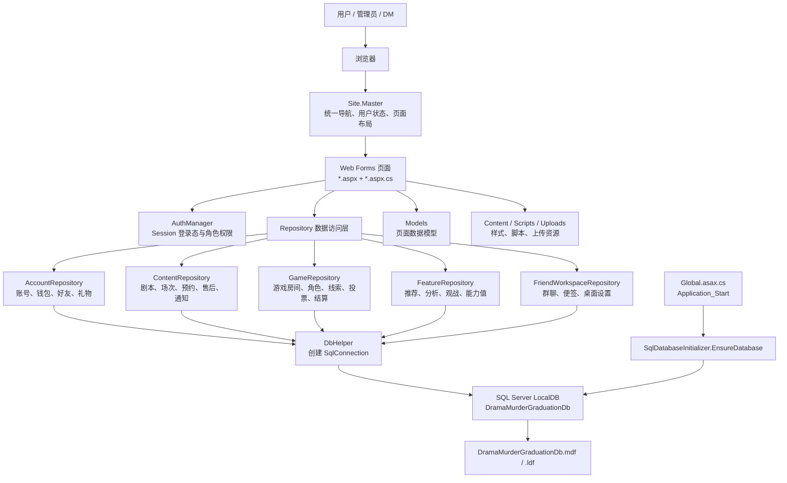
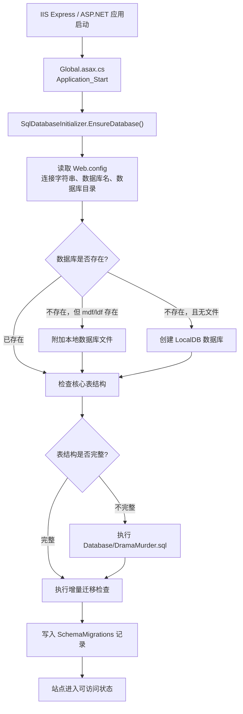
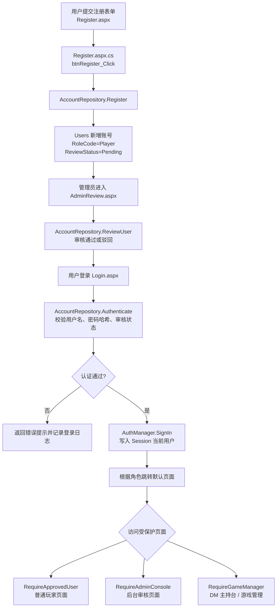
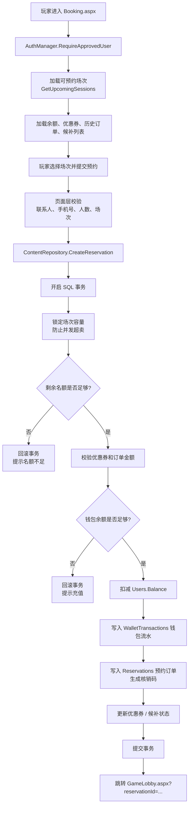
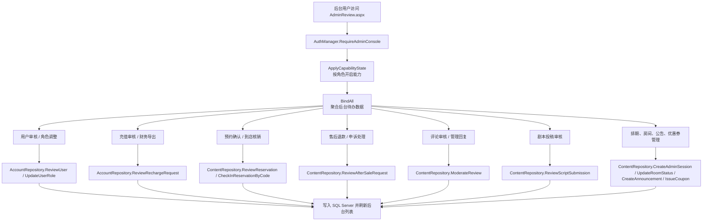
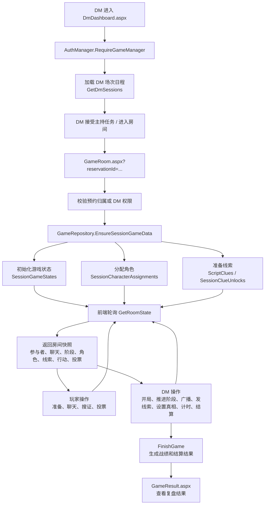
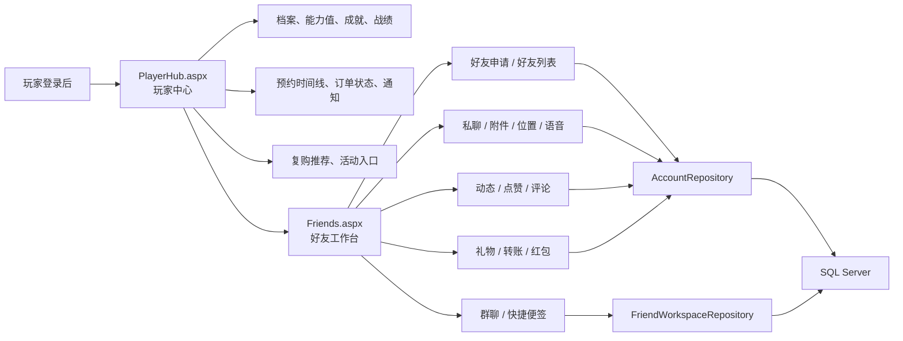

# DramaMurderGraduation 项目流程图

本文档根据当前项目源码整理，适合放入论文、答辩文档或 PPT。项目主体是 `DramaMurderGraduation.Web`，技术栈为 `.NET Framework 4.8.1 + ASP.NET Web Forms + C# + SQL Server LocalDB`。

## 1. 系统架构流程图

## 2. 项目启动与数据库初始化流程

## 3. 系统核心业务总流程

```mermaid
flowchart LR
    A["游客访问首页"] --> B["浏览剧本库、房间场次、评价、门店信息"]
    B --> C["注册账号"]
    C --> D["后台审核用户"]
    D --> E{"审核通过?"}
    E -- "否" --> C
    E -- "是" --> F["登录系统"]
    F --> G["钱包充值 / 获取优惠券"]
    G --> H["选择剧本和场次"]
    H --> I["提交预约"]
    I --> J["系统校验容量、余额、优惠券"]
    J --> K["扣费并生成预约订单"]
    K --> L["后台确认预约 / 到店核销"]
    L --> M["进入 GameLobby / GameRoom"]
    M --> N["DM 控场：开局、阶段、线索、投票、结算"]
    N --> O["玩家评价、复购推荐、好友互动"]
```

## 4. 登录、注册与权限控制流程

## 5. 在线预约与交易流程

## 6. 后台审核与运营管理流程

## 7. DM 主持与游戏房间流程

## 8. 玩家中心与社交流程

## 9. 主要源码对应关系

| 流程节点 | 主要源码 |
| --- | --- |
| 应用启动与建库 | `DramaMurderGraduation.Web/Global.asax.cs`、`DramaMurderGraduation.Web/Data/SqlDatabaseInitializer.cs` |
| 统一数据库连接 | `DramaMurderGraduation.Web/Data/DbHelper.cs` |
| 登录、注册、权限 | `DramaMurderGraduation.Web/Login.aspx.cs`、`DramaMurderGraduation.Web/Register.aspx.cs`、`DramaMurderGraduation.Web/Data/AuthManager.cs` |
| 账号、钱包、好友 | `DramaMurderGraduation.Web/Data/AccountRepository.cs` |
| 剧本、场次、预约、售后 | `DramaMurderGraduation.Web/Data/ContentRepository.cs`、`DramaMurderGraduation.Web/Booking.aspx.cs` |
| 后台审核 | `DramaMurderGraduation.Web/AdminReview.aspx.cs` |
| DM 主持台 | `DramaMurderGraduation.Web/DmDashboard.aspx.cs` |
| 游戏房间 | `DramaMurderGraduation.Web/GameRoom.aspx.cs`、`DramaMurderGraduation.Web/Data/GameRepository.cs` |
| 玩家中心与推荐 | `DramaMurderGraduation.Web/PlayerHub.aspx.cs`、`DramaMurderGraduation.Web/Data/FeatureRepository.cs` |
| 好友工作台 | `DramaMurderGraduation.Web/Friends.aspx.cs`、`DramaMurderGraduation.Web/Data/FriendWorkspaceRepository.cs` |
