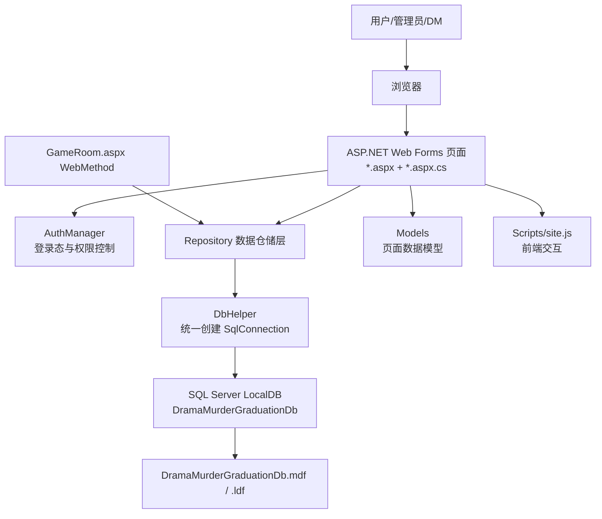
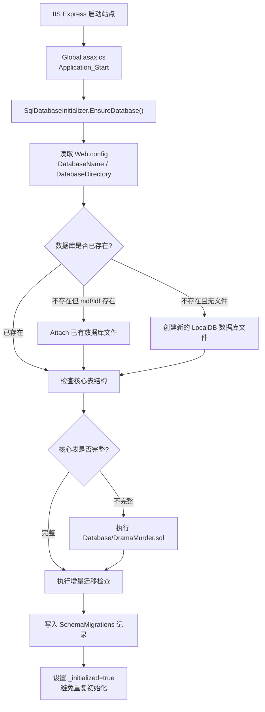
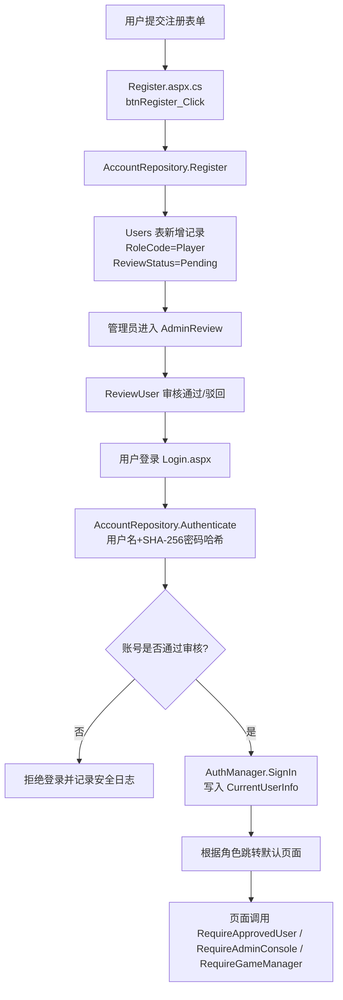
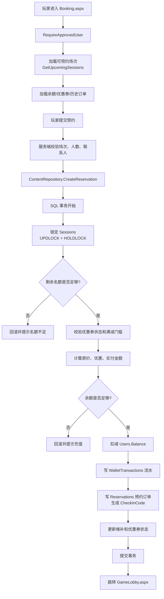
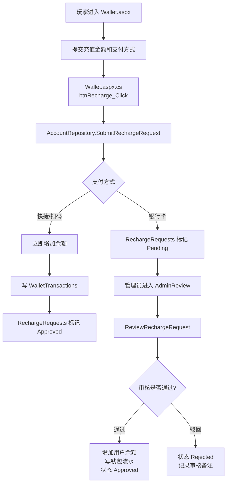
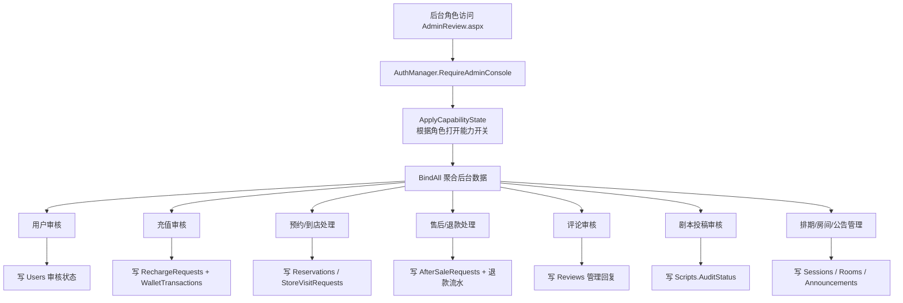
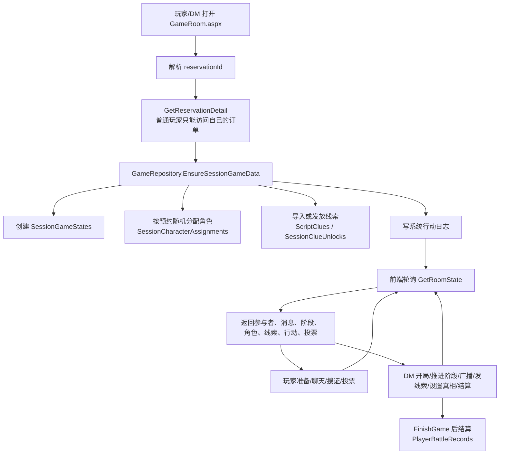
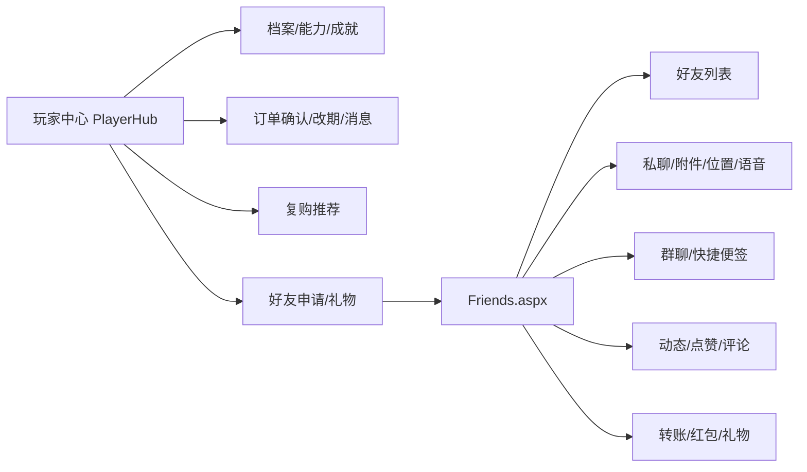
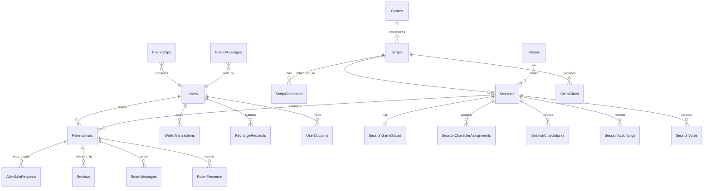

# 剧本杀门店运营与玩家服务系统答辩讲解文档

本文档面向毕业答辩讲解，重点说明 `DramaMurderGraduation` 项目的系统定位、整体流程、核心功能实现思路和可展示的流程图。项目源码位于 `DramaMurderGraduation.Web`，核心代码主要集中在页面代码后置 `*.aspx.cs`、数据仓储 `Data/`、数据模型 `Models/` 和数据库脚本 `Database/` 中。

## 1. 系统定位

本系统是一个基于 `.NET Framework 4.8.1 + ASP.NET Web Forms + C# + SQL Server LocalDB` 的剧本杀门店运营与玩家服务平台。它围绕线下剧本杀门店的真实业务流程设计，包括门店内容展示、玩家注册审核、在线预约扣费、钱包充值、后台运营审核、DM 控场、游戏房间互动、好友社交和玩家中心等模块。

答辩时可以这样概括：

> 这个系统不是单一的剧本展示页面，而是把“玩家选本、充值、预约、门店审核、到店核销、游戏过程、评价复购、社交互动”串成闭环的 Web 应用。系统采用 Web Forms 页面层、仓储数据访问层和 SQL Server 数据持久层的分层结构，核心业务通过数据库事务保证一致性。

## 2. 技术架构

主要技术点：

- 页面层：`Default.aspx`、`Booking.aspx`、`AdminReview.aspx`、`GameRoom.aspx` 等 Web Forms 页面负责表单、控件绑定和事件处理。
- 认证权限：`AuthManager.cs` 基于 `Session["CurrentUser"]` 保存当前登录用户，并提供 `RequireApprovedUser`、`RequireAdminConsole`、`RequireGameManager` 等统一校验入口。
- 数据访问：`AccountRepository`、`ContentRepository`、`GameRepository`、`FeatureRepository`、`FriendWorkspaceRepository` 通过 ADO.NET 参数化 SQL 读写数据库。
- 数据库初始化：`Global.asax.cs` 在站点启动时调用 `SqlDatabaseInitializer.EnsureDatabase()`，自动创建或附加 LocalDB，并执行基础脚本和增量迁移。
- 实时交互：`GameRoom.aspx.cs` 使用带 `WebMethod` 的 JSON 接口支撑房间状态轮询、聊天、准备、搜证、投票和 DM 控场操作。

## 3. 代码目录职责

| 目录/文件 | 作用 |
| --- | --- |
| `DramaMurderGraduation.Web/*.aspx` | Web Forms 页面标记，定义前端控件和布局 |
| `DramaMurderGraduation.Web/*.aspx.cs` | 页面代码后置，处理 Page_Load、按钮事件、Repeater 命令等 |
| `DramaMurderGraduation.Web/Data` | 数据仓储层和数据库初始化逻辑 |
| `DramaMurderGraduation.Web/Models` | 页面和仓储之间传递的数据模型 |
| `DramaMurderGraduation.Web/Database/DramaMurder.sql` | 基础建表与初始化数据脚本 |
| `DramaMurderGraduation.Web/Database/SeedMockData.sql` | 演示数据脚本 |
| `DramaMurderGraduation.Web/Site.Master` | 全站母版页，统一导航、用户状态、统计信息 |
| `DramaMurderGraduation.Web/Scripts/site.js` | 前端公共交互脚本 |
| `DramaMurderGraduation.Web/Uploads` | 用户上传头像、动态、聊天附件、售后凭证等 |

## 4. 系统启动与数据库初始化流程

实现思路：

- `Global.asax.cs` 是整个 Web 应用生命周期的入口，在应用启动时执行数据库检查。
- `SqlDatabaseInitializer.cs` 支持数据库文件创建、已有 `.mdf/.ldf` 文件附加、基础脚本执行和增量字段补齐。
- `SchemaMigrations` 表记录迁移 Key、脚本校验和、执行时间、是否成功，避免每次启动重复执行相同脚本。
- 初始化逻辑使用进程内锁和 `_initialized` 标记，避免多个请求同时启动时重复初始化数据库。

## 5. 核心业务总流程

```mermaid
flowchart LR
    A["游客访问首页"] --> B["浏览剧本/房间/场次"]
    B --> C["注册账号"]
    C --> D["后台审核用户"]
    D --> E["登录成为已审核玩家"]
    E --> F["钱包充值"]
    F --> G["选择场次并预约"]
    G --> H["系统扣费并生成预约订单"]
    H --> I["门店后台确认订单"]
    I --> J["玩家到店核销"]
    J --> K["进入游戏大厅/房间"]
    K --> L["DM 控场：开局、阶段、线索、投票、结算"]
    L --> M["玩家评价、复购推荐、好友互动"]
```

这一张图适合放在答辩 PPT 的“系统整体流程”页，说明系统覆盖了门店业务的完整闭环。

## 6. 登录、注册与权限控制

实现要点：

- `AccountRepository.Register` 写入 `Users` 表，新用户默认是 `Player`，审核状态为 `Pending`。
- `AccountRepository.Authenticate` 使用 `AuthManager.HashPassword` 生成 SHA-256 哈希后查询用户，同时校验审核状态。
- 登录成功后，`AuthManager.CreateCurrentUser` 只把页面需要的轻量用户信息写入 Session，不把完整用户表记录放入 Session。
- `Site.Master.cs` 每次请求会重新读取最新用户状态，防止管理员改变用户审核状态后旧 Session 继续保留权限。
- 后台、DM、玩家中心等页面不重复写权限判断，而是统一调用 `AuthManager` 的权限方法。

## 7. 在线预约与钱包扣费流程

这是系统最适合答辩重点讲的核心业务，因为它体现了完整的业务一致性设计。

实现要点：

- 页面层 `Booking.aspx.cs` 先做基础表单校验，例如人数必须在 1 到 8 之间、联系人不能为空。
- 真正可靠的校验在 `ContentRepository.CreateReservation` 中完成，避免用户绕过前端。
- SQL 使用 `WITH (UPDLOCK, HOLDLOCK)` 锁定场次容量计算，减少并发预约导致超卖的风险。
- 预约创建放在事务里，一次性完成“扣余额、写钱包流水、写预约订单、标记优惠券已使用、处理候补状态”。
- 预约成功后跳转 `GameLobby.aspx?reservationId=...`，玩家可以确认安排、申请改期或进入游戏房间。

## 8. 充值、钱包与财务审核流程

实现要点：

- `Wallet.aspx.cs` 控制不同支付方式的页面提示和输入校验。
- `SubmitRechargeRequest` 支持即时到账和人工审核两种路径。
- `ReviewRechargeRequest` 对银行卡充值在事务内完成余额增加、流水写入和审核状态更新。
- 后台财务页还可以查看充值审核记录、钱包流水、退款金额、优惠券抵扣和异常流水统计。

## 9. 后台审核与运营管理流程

实现要点：

- `AdminReview.aspx.cs` 是后台聚合工作台，页面中多个 `Repeater` 绑定不同待办数据。
- 权限不是只有“管理员/非管理员”，而是分成会员管理、财务、运营、内容审核等能力开关。
- 后台操作会调用仓储层对应方法，例如 `ReviewUser`、`ReviewRechargeRequest`、`ReviewReservation`、`ReviewAfterSaleRequest`、`ReviewScriptSubmission`。
- 预约、售后和到店联系支持给玩家写可见回复，并通过 `AdminReplyLogs`、`BusinessActionLogs` 形成操作留痕。

## 10. DM 游戏房间流程

实现要点：

- `GameRoom.aspx.cs` 首屏只渲染房间基础信息，动态状态通过 `WebMethod` 返回 JSON。
- `GetRoomState` 一次性返回房间需要的完整状态快照，包括参与者在线状态、聊天记录、阶段时间线、当前角色、可见线索、行动日志、投票汇总和结案真相。
- 玩家操作包括 `ToggleReady`、`SubmitAction`、`SubmitVote`、发送文字/语音消息、同步摄像头和麦克风状态。
- DM 操作包括 `StartGame`、`AdvanceStage`、`SetStage`、`BroadcastNotice`、`RevealClue`、`SaveTruth`、`SaveDmNotes`、`StartTimer`、`FinishGame`。
- `EnsureSessionGameData` 使用 Serializable 事务保证角色分配和初始线索发放不会因为多人同时进入房间而重复执行。

## 11. 玩家中心与社交互动流程

实现要点：

- `PlayerHub.aspx.cs` 聚合玩家档案、能力值、成就、战绩、订单时间线、通知和复购推荐。
- `Friends.aspx.cs` 负责更完整的社交工作台，包括好友申请、私聊、群聊、动态、礼物和转账。
- `AccountRepository` 管理好友、私聊、礼物、转账、动态、拉黑等账户社交数据。
- `FriendWorkspaceRepository` 管理群聊、快捷便签和桌面设置等扩展工作区能力。
- `UploadHelper.cs` 限制上传文件类型和 20MB 大小，并按月份和业务类别保存到 `Uploads/Friends/...`。

## 12. 数据库核心表关系

答辩讲解可以把数据库分成四组：

- 基础经营数据：`SiteSettings`、`Genres`、`Scripts`、`ScriptCharacters`、`Rooms`、`Sessions`。
- 交易订单数据：`Reservations`、`ReservationWaitlists`、`WalletTransactions`、`RechargeRequests`、`UserCoupons`、`AfterSaleRequests`。
- 游戏过程数据：`GameStages`、`SessionGameStates`、`SessionCharacterAssignments`、`ScriptClues`、`SessionClueUnlocks`、`SessionActionLogs`、`SessionVotes`。
- 社交与用户数据：`Users`、`PlayerProfiles`、`Friendships`、`FriendMessages`、`FriendMoments`、`GiftTransactions`、`FriendMoneyTransfers`。

## 13. 核心功能实现思路总结

### 13.1 分层设计

页面层负责接收用户输入、绑定控件和展示反馈；仓储层负责业务 SQL；模型层负责数据承载；数据库层负责持久化。这样做的好处是页面逻辑和 SQL 访问相对分离，后续扩展页面或调整数据结构时更容易定位。

### 13.2 统一认证和权限

所有需要登录的页面都通过 `AuthManager` 进行统一校验。普通玩家使用 `RequireApprovedUser`，后台工作台使用 `RequireAdminConsole`，DM 游戏管理使用 `RequireGameManager`。这样可以减少每个页面重复写权限判断造成的遗漏。

### 13.3 事务保证关键业务一致性

预约、充值审核、礼物/转账、游戏初始化等操作涉及多张表，仓储层使用数据库事务来保证要么全部成功，要么全部回滚。例如预约流程必须同时完成余额扣减、钱包流水、预约订单和优惠券状态更新，不能出现只扣钱不生成订单的情况。

### 13.4 参数化 SQL 与服务端校验

仓储层普遍使用 `SqlCommand.Parameters.AddWithValue` 传入参数，避免直接拼接用户输入。页面层做基础校验，仓储层和 SQL 再做容量、余额、优惠券、状态等关键校验，形成前后两层保护。

### 13.5 游戏房间采用状态快照接口

游戏房间不是每个小区域单独请求，而是通过 `GetRoomState` 返回一个完整状态快照。前端拿到快照后更新参与者、消息、阶段、角色、线索、投票等区域。这个设计适合 Web Forms 项目实现准实时互动，复杂度比引入 SignalR 更低。

### 13.6 数据库可自动初始化和迁移

系统启动时自动检查数据库是否存在和表结构是否完整，减少部署演示时手动建库步骤。增量迁移记录到 `SchemaMigrations`，能支撑后续继续添加字段和表。

## 14. 可重点展示的页面

| 页面 | 答辩展示重点 |
| --- | --- |
| `Default.aspx` | 首页聚合公告、剧本、场次、评分和门店指标 |
| `ScriptsList.aspx` / `ScriptDetails.aspx` | 剧本浏览、详情、角色、素材和场次入口 |
| `Wallet.aspx` | 充值、余额、钱包流水、礼物币兑换 |
| `Booking.aspx` | 在线预约、优惠券、候补、我的订单、售后申请 |
| `AdminReview.aspx` | 用户审核、充值审核、预约处理、售后、评论、排期和财务汇总 |
| `GameLobby.aspx` | 预约后进入游戏前的确认与准备 |
| `GameRoom.aspx` | DM 控场、玩家准备、聊天、搜证、投票和结算 |
| `PlayerHub.aspx` | 玩家档案、能力、成就、订单时间线和复购推荐 |
| `Friends.aspx` | 好友、私聊、群聊、动态、礼物、转账 |

## 15. 答辩讲解顺序建议

1. 先讲系统背景：线下剧本杀门店需要同时管理内容、场次、预约、财务、玩家和游戏过程。
2. 再讲总体架构：Web Forms 页面层、C# 仓储层、SQL Server 数据库、Session 权限控制。
3. 展示核心闭环：注册审核 -> 充值 -> 预约扣费 -> 后台确认 -> 游戏房间 -> 评价复购。
4. 重点展开预约流程：这是交易一致性最强的业务，能体现并发校验、事务、流水和订单状态。
5. 再展开游戏房间：说明为什么使用 WebMethod 状态快照，以及 DM 和玩家分别能做什么。
6. 最后讲可扩展点：后台能力拆分、数据库迁移、AI 网关客户端、社交和复购推荐。

## 16. 答辩口径示例

可以直接按下面这段讲：

> 我的系统采用 ASP.NET Web Forms 开发，主要分为页面展示层、业务仓储层和 SQL Server 数据层。用户从首页浏览剧本和场次，注册后需要管理员审核，审核通过才能登录预约。预约时系统会在服务端重新校验场次容量、优惠券和余额，并在数据库事务中完成余额扣减、钱包流水、预约订单和优惠券状态更新。后台管理员可以在审核中心统一处理用户、充值、预约、售后和内容审核。到店后玩家可以进入游戏房间，房间状态通过 WebMethod 返回 JSON 快照，支持玩家准备、聊天、搜证、投票，也支持 DM 开局、推进阶段、发放线索、设置真相和结算。整个系统形成了从选本到预约、从门店运营到游戏互动、再到评价复购和社交传播的完整业务闭环。

## 17. 源码对应关系

| 讲解点 | 对应源码 |
| --- | --- |
| 应用启动和数据库初始化 | `Global.asax.cs`、`Data/SqlDatabaseInitializer.cs` |
| 统一数据库连接 | `Data/DbHelper.cs` |
| 登录态和权限控制 | `Data/AuthManager.cs`、`Models/CurrentUserInfo.cs` |
| 账号、钱包、好友、礼物 | `Data/AccountRepository.cs` |
| 剧本、场次、预约、售后、通知 | `Data/ContentRepository.cs` |
| DM 游戏房间 | `GameRoom.aspx.cs`、`Data/GameRepository.cs` |
| 玩家中心和推荐 | `PlayerHub.aspx.cs`、`Data/FeatureRepository.cs` |
| 好友工作台 | `Friends.aspx.cs`、`Data/FriendWorkspaceRepository.cs` |
| 后台审核中心 | `AdminReview.aspx.cs` |
| 数据库表结构 | `Database/DramaMurder.sql`、`Data/SqlDatabaseInitializer.cs` |

## 18. 注意事项

- `Web.config` 中包含 AI 供应商配置项，答辩演示时不要展示真实密钥。
- 部分源码注释或字符串在当前终端读取时出现编码显示异常，但项目整体按 `zh-CN` 和 UTF-8 配置运行。
- 如果答辩需要导出为 Word 或 PPT，可先用支持 Mermaid 的 Markdown 工具渲染本文件，再截图或复制流程图。

